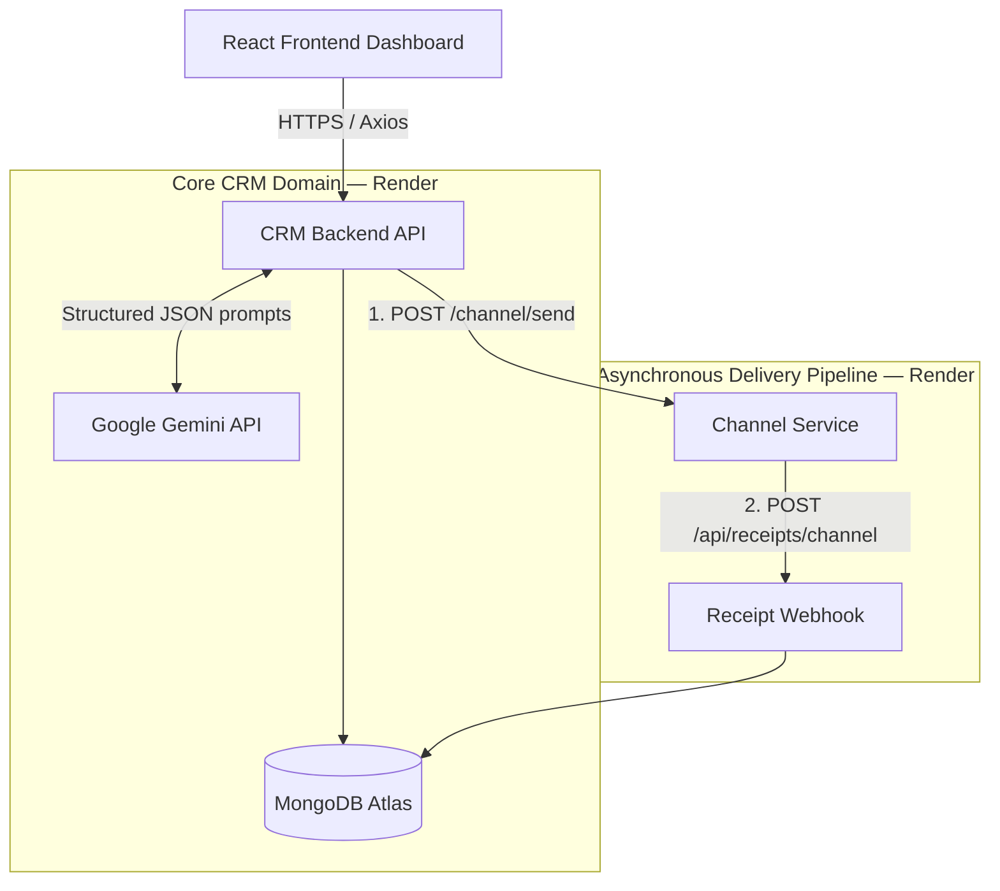

<div align="center">

# Xeno AI-Native Mini CRM

**An intent-driven marketing platform where AI replaces manual query building.**  
Marketers describe their goal in plain English — the system does the rest.

[](https://xeno-ai-crm.vercel.app)
[](https://xeno-crm-backend-bnqv.onrender.com)
[](https://xeno-channel-service-34wf.onrender.com)
[](https://www.mongodb.com/atlas)


</div>

---

## Table of Contents

1. [Live Demo](#1-live-demo)
2. [Project Overview](#2-project-overview)
3. [Deployment Architecture](#3-deployment-architecture)
4. [System Architecture](#4-system-architecture)
5. [Features](#5-features)
6. [The AI-Native Approach](#6-the-ai-native-approach)
7. [API Endpoints](#7-api-endpoints)
8. [Tech Stack](#8-tech-stack)
9. [Project Structure](#9-project-structure)
10. [Local Setup](#10-local-setup)
11. [Environment Variables](#11-environment-variables)
12. [Database Seeding](#12-database-seeding)
13. [Engineering Decisions](#13-engineering-decisions)
14. [Scaling Path](#14-scaling-path)
15. [Tradeoffs & Known Limitations](#15-tradeoffs--known-limitations)
16. [Future Improvements](#16-future-improvements)
17. [Screenshots](#17-screenshots)

---

## 1. Live Demo

| Service | URL | Status |
| :--- | :--- | :--- |
| **Frontend** (Vercel) | [xeno-ai-crm.vercel.app](https://xeno-ai-crm.vercel.app) | 🟢 Live |
| **CRM Backend** (Render) | [xeno-crm-backend-bnqv.onrender.com](https://xeno-crm-backend-bnqv.onrender.com) | 🟢 Live |
| **Channel Service** (Render) | [xeno-channel-service-34wf.onrender.com](https://xeno-channel-service-34wf.onrender.com) | 🟢 Live |
| **Database** | MongoDB Atlas (AWS ap-south-1) | 🟢 Live |

> **Note:** Render free-tier services may spin down after inactivity. Allow 30–60 seconds on first load.  
> Production data: **1,000 customers** and **5,000 orders** are pre-seeded.

---

## 2. Project Overview

The traditional CRM model forces marketers to manually assemble audience filters and write copy from scratch. This project demonstrates an **intent-driven workflow** that eliminates that friction.

A marketer types a plain-English goal (e.g., *"Bring back premium customers who haven't purchased in 60 days"*). The system:

1. **Translates** the intent into a structured MongoDB query via Gemini AI
2. **Previews** the matching audience before any message is sent
3. **Generates** channel-specific copy (Email, SMS, WhatsApp) with `{{name}}` personalization
4. **Dispatches** the campaign asynchronously to a dedicated channel microservice
5. **Tracks** every message through its full lifecycle: `Pending → Sent → Delivered → Opened → Clicked / Failed`
6. **Analyzes** delivery funnel performance with AI-generated strategic recommendations

The marketer acts as an **editor and approver** — not a query builder or copywriter.

---

## 3. Deployment Architecture

```
┌─────────────────────────────────────────────────────────────────────────┐
│                          USER'S BROWSER                                  │
│                  React + Vite SPA (Vercel CDN)                           │
│                   https://xeno-ai-crm.vercel.app                         │
└─────────────────────────────┬───────────────────────────────────────────┘
                              │ HTTPS (Axios)
                              ▼
┌─────────────────────────────────────────────────────────────────────────┐
│                         CRM BACKEND (Render)                             │
│              Node.js + Express — xeno-crm-backend-bnqv.onrender.com      │
│                                                                           │
│  ┌──────────────┐  ┌──────────────┐  ┌──────────────┐  ┌─────────────┐ │
│  │  /customers  │  │  /campaigns  │  │  /receipts   │  │  /ai        │ │
│  └──────────────┘  └──────────────┘  └──────────────┘  └─────────────┘ │
│                          │                  ▲              │             │
│                          │ Dispatch         │ Webhook      │ Prompt      │
└──────────────────────────┼──────────────────┼──────────────┼────────────┘
              │            │                  │              │
              ▼            ▼                  │              ▼
   ┌─────────────────┐  ┌────────────────────┴──────┐   ┌────────────────┐
   │  MongoDB Atlas  │  │   CHANNEL SERVICE (Render) │   │  Google Gemini │
   │  (AWS ap-south) │  │  xeno-channel-service-34wf │   │  gemini-1.5    │
   │                 │  │  .onrender.com             │   │  -flash API    │
   │  • customers    │  │                            │   └────────────────┘
   │  • orders       │  │  Simulates: WhatsApp / SMS │
   │  • campaigns    │  │  Email delivery & receipts │
   │  • comm_logs    │  └────────────────────────────┘
   └─────────────────┘
```

---

## 4. System Architecture

The system is decoupled into three independently deployable tiers.



### Data Flow — Campaign Launch

```
Marketer types goal
       │
       ▼
POST /api/ai/segment          ← Gemini converts NL → JSON rules
       │
       ▼
POST /api/campaigns/preview   ← Dry-run: count matching customers, no messages sent
       │ (marketer reviews audience)
       ▼
POST /api/campaigns           ← Campaign document created, status = "draft"
       │
       ▼
POST /api/campaigns/:id/launch
       │
       ├── For each matched customer:
       │      POST /channel/send (Channel Service)
       │                │
       │                └── setTimeout 1–5s (simulates provider latency)
       │                       │
       │                       └── POST /api/receipts/channel  ← async callback
       │                                  │
       │                                  └── CommunicationLog updated
       │                                      (Pending → Sent → Delivered/Failed)
       ▼
Campaign status = "active" — marketer sees live stats
```

---

## 5. Features

| Feature | Description |
| :--- | :--- |
| **Customer Ingestion API** | Bulk-import customer profiles via REST API with denormalized purchase summaries |
| **Order Management** | Processes orders and atomically updates customer `purchaseSummary` on write |
| **AI Segmentation** | Translates plain-English goals into strict, verifiable MongoDB query rules |
| **AI Message Generation** | Produces channel-specific copy (Email/SMS/WhatsApp) with `{{name}}` placeholders |
| **Audience Preview** | Dry-run endpoint returns matched customer count before any message is sent |
| **Campaign Lifecycle** | Full `draft → active → completed` state machine with per-customer tracking |
| **Async Delivery Pipeline** | Fire-and-forget dispatch to Channel Service with webhook-based receipt callbacks |
| **Communication Logs** | Per-message status history: `Pending → Sent → Delivered → Opened → Clicked / Failed` |
| **AI Analytics** | Gemini interprets funnel metrics against industry benchmarks and returns strategic advice |
| **Graceful AI Fallback** | If Gemini is unavailable, hardcoded sensible defaults keep all features functional |

---

## 6. The AI-Native Approach

This is **not a chatbot wrapper**. AI drives real, typed, actionable product features.

### Structured JSON Enforcement

Every AI prompt is engineered to return deterministic, machine-readable output:

```json
// POST /api/ai/segment
// Input: { "goal": "Re-engage premium buyers who haven't purchased in 60 days" }

// Gemini Output (parsed and validated before use):
{
  "segmentName": "Lapsed Premium Buyers",
  "rules": {
    "minSpend": 5000,
    "inactiveDays": 60
  },
  "rationale": "Targets high-value customers showing churn risk."
}
```

The output feeds directly into a MongoDB query — no human parsing required.

### AI Service Abstraction

All Gemini calls are isolated in `src/services/aiService.js`. This means:
- Swapping to OpenAI, Claude, or a fine-tuned model requires changes in **one file only**
- Each endpoint (`/segment`, `/message`, `/insights`) has its own prompt template and validation layer
- Temperature is set to `0.2` for deterministic JSON; slightly higher (`0.7`) for creative copy

### Graceful Degradation

```
Gemini API call
    ├── Success → return structured JSON
    └── Failure (network, rate limit, missing key)
            └── return hardcoded fallback
                    (system continues functioning normally)
```

---

## 7. API Endpoints

### CRM Backend — `https://xeno-crm-backend-bnqv.onrender.com`

#### Customers
| Method | Endpoint | Description |
| :--- | :--- | :--- |
| `GET` | `/api/customers` | List all customers (paginated) |
| `POST` | `/api/customers` | Create a new customer |
| `GET` | `/api/customers/:id` | Get a single customer by ID |

#### Orders
| Method | Endpoint | Description |
| :--- | :--- | :--- |
| `POST` | `/api/orders` | Create an order (auto-updates customer summary) |
| `GET` | `/api/orders/customer/:customerId` | Get purchase history for a customer |

#### Campaigns
| Method | Endpoint | Description |
| :--- | :--- | :--- |
| `GET` | `/api/campaigns` | List all campaigns |
| `POST` | `/api/campaigns` | Create a campaign draft |
| `POST` | `/api/campaigns/preview` | Dry-run — count audience without sending |
| `GET` | `/api/campaigns/:id` | Get campaign with live delivery stats |
| `POST` | `/api/campaigns/:id/launch` | Dispatch messages to all matched customers |
| `GET` | `/api/campaigns/:id/logs` | Per-customer delivery log with status history |

#### AI Agent
| Method | Endpoint | Description |
| :--- | :--- | :--- |
| `POST` | `/api/ai/segment` | Translate NL goal → structured segment rules |
| `POST` | `/api/ai/message` | Generate channel-specific message template |
| `GET` | `/api/ai/insights/:campaignId` | AI analysis of campaign funnel performance |

#### Receipts (machine-to-machine)
| Method | Endpoint | Description |
| :--- | :--- | :--- |
| `POST` | `/api/receipts/channel` | Webhook called by Channel Service after delivery |

---

### Channel Service — `https://xeno-channel-service-34wf.onrender.com`

| Method | Endpoint | Description |
| :--- | :--- | :--- |
| `GET` | `/health` | Service health check |
| `POST` | `/channel/send` | Accept a message dispatch, simulate delivery, callback CRM |

---

## 8. Tech Stack

| Layer | Technology | Purpose |
| :--- | :--- | :--- |
| **Frontend** | React 18, Vite | SPA framework + fast HMR dev server |
| **UI Styling** | Tailwind CSS | Utility-first styling |
| **Charts** | Recharts | Campaign funnel visualization |
| **HTTP Client** | Axios | API communication with interceptors |
| **Icons** | Lucide React | Consistent iconography |
| **Backend** | Node.js 18, Express 4 | REST API server |
| **Database** | MongoDB Atlas, Mongoose | Document DB with schema validation |
| **AI** | Google Gemini (`gemini-1.5-flash`) | Segmentation, copy generation, analytics |
| **HTTP Logging** | Morgan | Request logging middleware |
| **Dev Tooling** | Faker.js, Nodemon | Data seeding and hot reload |
| **Frontend Deploy** | Vercel | Global CDN, automatic HTTPS |
| **Backend Deploy** | Render | Managed Node.js hosting |

---

## 9. Project Structure

```
xeno-ai-crm/
├── README.md
├── architecture.md
│
├── frontend/                         # React + Vite SPA
│   ├── src/
│   │   ├── components/
│   │   │   ├── Layout.jsx            # App shell with sidebar
│   │   │   └── Sidebar.jsx           # Navigation
│   │   ├── pages/
│   │   │   ├── Dashboard.jsx         # KPI overview + charts
│   │   │   ├── Customers.jsx         # Customer list + search
│   │   │   ├── CampaignStudio.jsx    # AI goal → segment → launch
│   │   │   └── Analytics.jsx        # Campaign funnel + AI insights
│   │   ├── services/
│   │   │   └── api.js               # Axios instance + base URL
│   │   └── App.jsx
│   ├── .env.example
│   └── vercel.json                  # SPA routing config
│
├── crm-backend/                      # Core CRM API (Express)
│   ├── src/
│   │   ├── config/                  # DB connection
│   │   ├── models/
│   │   │   ├── Customer.js          # Schema with purchaseSummary + engagement
│   │   │   ├── Order.js             # Line-items with totalAmount
│   │   │   ├── Campaign.js          # Segment rules + status state machine
│   │   │   └── CommunicationLog.js  # Per-message lifecycle tracking
│   │   ├── controllers/             # Request handlers (thin layer)
│   │   ├── services/
│   │   │   ├── aiService.js         # All Gemini interactions + fallbacks
│   │   │   ├── campaignService.js   # Dispatch orchestration logic
│   │   │   ├── customerService.js
│   │   │   └── orderService.js
│   │   ├── routes/
│   │   │   ├── aiRoutes.js
│   │   │   ├── campaignRoutes.js
│   │   │   ├── customerRoutes.js
│   │   │   ├── orderRoutes.js
│   │   │   └── receiptRoutes.js     # Webhook-only, separate namespace
│   │   ├── middleware/
│   │   └── utils/
│   ├── scripts/
│   │   ├── seed.js                  # 1000 customers + 5000 orders
│   │   └── testAI.js               # AI service smoke tests
│   └── .env.example
│
└── channel-service/                  # Stateless delivery simulator (Express)
    ├── src/
    │   ├── controllers/
    │   ├── routes/
    │   │   └── messageRoutes.js     # POST /channel/send
    │   ├── services/
    │   │   └── deliverySimulator.js # WhatsApp / Email / SMS + failure rates
    │   └── middleware/
    └── .env.example
```

---

## 10. Local Setup

### Prerequisites

- Node.js v18+
- MongoDB running locally on port `27017` *(or use your Atlas connection string)*

### Step 1 — CRM Backend

```bash
cd crm-backend
npm install
cp .env.example .env
# Edit .env: set MONGO_URI and GEMINI_API_KEY
npm run seed        # Seeds 1000 customers + 5000 orders
npm run dev         # Starts on http://localhost:5001
```

### Step 2 — Channel Service

```bash
cd channel-service
npm install
cp .env.example .env
# Edit .env: confirm CRM_BACKEND_URL=http://localhost:5001
npm run dev         # Starts on http://localhost:5002
```

### Step 3 — Frontend

```bash
cd frontend
npm install
cp .env.example .env
# Edit .env: VITE_API_URL=http://localhost:5001
npm run dev         # Starts on http://localhost:5173
```

> All three services must be running simultaneously for the full feature set to work.

---

## 11. Environment Variables

### `crm-backend/.env`

```env
# Server
PORT=5001
NODE_ENV=development

# MongoDB — use Atlas URI in production
MONGO_URI=mongodb://localhost:27017/xeno-crm

# Channel Service URL
CHANNEL_SERVICE_URL=http://localhost:5002

# Google Gemini API Key
# Get yours at: https://aistudio.google.com/app/apikey
# Omitting this key is safe — AI endpoints return hardcoded fallbacks.
GEMINI_API_KEY=your_gemini_api_key_here
```

### `channel-service/.env`

```env
PORT=5002
NODE_ENV=development

# CRM Backend — Channel Service POSTs receipts back here
CRM_BACKEND_URL=http://localhost:5001
```

### `frontend/.env`

```env
# Points to CRM Backend (no trailing slash, no /api suffix)
VITE_API_URL=http://localhost:5001

# Production (set in Vercel dashboard → Project Settings → Environment Variables)
# VITE_API_URL=https://xeno-crm-backend-bnqv.onrender.com
```

> ⚠️ **Never commit `.env` files.** Each service has its own `.gitignore` that excludes `.env`. Only `.env.example` files are version-controlled.

---

## 12. Database Seeding

The seed script (`crm-backend/scripts/seed.js`) generates realistic Indian e-commerce data using `@faker-js/faker`:

```bash
cd crm-backend
npm run seed
```

**What gets seeded:**

| Collection | Count | Notes |
| :--- | :--- | :--- |
| `customers` | 1,000 | Name, email, phone, city, age, gender, preferred channel, open rates |
| `orders` | 5,000 | 1–4 line items per order, random assignment to customers |
| `purchaseSummary` | Computed | `totalSpend`, `totalOrders`, `lastPurchaseDate` denormalized onto each customer via `bulkWrite` |

The seed script uses `insertMany` with `ordered: false` for bulk performance and a MongoDB aggregation pipeline to compute purchase summaries in a single database round-trip.

---

## 13. Engineering Decisions

### Why a Separate Channel Service?

Third-party providers (Twilio, SendGrid, Meta) are unreliable. Isolating delivery into its own microservice means:
- The CRM backend is never blocked waiting for a delivery confirmation
- The channel service can be scaled, replaced, or rate-limited independently
- In production, this HTTP endpoint is replaced with a Kafka consumer — zero changes to the CRM backend

### Why MongoDB?

- **Flexible schema**: Customer attributes and segment rules evolve frequently; a rigid SQL schema would require constant migrations
- **Denormalization-friendly**: The `purchaseSummary` pattern (computing aggregates on write) is idiomatic MongoDB and eliminates expensive runtime aggregations across millions of order rows
- **Document-per-campaign**: Campaign rules are stored as embedded JSON — a natural fit for the dynamic segment rule structure Gemini returns

### Why Denormalized Purchase Summaries?

Running `SUM(totalAmount)` across 5,000+ orders **per customer, per segmentation query** would make campaign preview unusably slow at scale. Instead, `totalSpend`, `totalOrders`, and `lastPurchaseDate` are computed once on order write and stored directly on the Customer document. Segmentation queries become a single indexed collection scan.

### Why an AI Service Abstraction Layer?

All Gemini interactions live in `src/services/aiService.js`. Swapping to OpenAI, Claude, or a self-hosted model requires changes in **one file only**. Each function has:
1. A carefully engineered prompt with a JSON schema
2. A response parser and validator
3. A hardcoded fallback for when the API is unavailable

### Why a Dedicated `receiptRoutes` Namespace?

Delivery receipts are machine-to-machine traffic (not user-facing). Isolating them under `/api/receipts` makes it trivial to:
- Add shared-secret or HMAC authentication only to this router
- Apply different rate limits (receipts arrive in bursts during large campaigns)
- Replace this HTTP endpoint with a Kafka consumer in production with zero impact on other routes

### Why `Promise.allSettled` for Campaign Dispatch?

`Promise.all` fails fast — if one message fails, the entire campaign dispatch throws. `Promise.allSettled` waits for every dispatch attempt to resolve or reject, ensuring a single network failure never aborts delivery to the remaining audience.

---

## 14. Scaling Path

| Component | Current Implementation | Production Evolution |
| :--- | :--- | :--- |
| **Database** | MongoDB Atlas (shared cluster) | Replica Set with read replicas + Atlas Search |
| **Campaign Dispatch** | `Promise.allSettled` (in-process) | Kafka / BullMQ task queue + dedicated worker nodes |
| **Delivery Receipts** | Synchronous webhook HTTP | Webhook ingestion queue → Redis → async processing |
| **AI Calls** | Direct per-request Gemini API | Prompt caching + request batching + rate-limit retry queue |
| **Analytics** | On-the-fly Mongoose aggregations | Pre-aggregated daily snapshots → ClickHouse / Snowflake |
| **Authentication** | None (assignment scope) | JWT + refresh tokens + role-based access control |
| **Frontend** | Single Vercel deployment | CDN edge caching + A/B testing via Vercel Edge Config |

---

## 15. Tradeoffs & Known Limitations

| Area | Current | Production Standard |
| :--- | :--- | :--- |
| **Authentication** | None | JWT middleware on all routes |
| **Message Queue** | `setTimeout` + `Promise.allSettled` | SQS / Kafka — crash-safe, retryable |
| **Personalization** | `.replace()` regex for `{{name}}` | Handlebars / Liquid templating engine |
| **Delivery Simulation** | Random 90% success rate | Real Twilio / SendGrid API integration |
| **Error Monitoring** | `console.error` | Sentry / Datadog with alerting |
| **API Validation** | Basic null checks | Zod / Joi schema validation on all request bodies |

---

## 16. Future Improvements

- [ ] **JWT Authentication** — Protect all API routes; add login/register flow to frontend
- [ ] **Redis + BullMQ Queue** — Replace in-process dispatch with a crash-safe, retryable task queue
- [ ] **Docker + Docker Compose** — One-command local setup for all three services
- [ ] **CI/CD Pipeline** — GitHub Actions: lint → test → deploy to Render/Vercel on merge to `main`
- [ ] **Monitoring & Observability** — Sentry error tracking, Morgan structured logging, Prometheus metrics
- [ ] **Request Validation** — Zod schemas on all incoming request bodies
- [ ] **Rate Limiting** — Express `rate-limiter-flexible` on AI and launch endpoints
- [ ] **Real Provider Integration** — Replace delivery simulator with Twilio (SMS/WhatsApp) and SendGrid (Email)
- [ ] **A/B Message Testing** — Generate multiple copy variants per campaign, split test automatically
- [ ] **Webhook Security** — HMAC signature verification on `/api/receipts/channel`

---

## 17. Screenshots

> 📸 **Screenshots coming soon.** The live demo is available at [xeno-ai-crm.vercel.app](https://xeno-ai-crm.vercel.app).

| Page | Description |
| :--- | :--- |
| Dashboard | KPI cards + customer growth + revenue charts |
| Customers | Searchable customer table with purchase history |
| Campaign Studio | AI goal input → segment preview → message generation → launch |
| Analytics | Campaign funnel charts + AI-generated performance insights |

---

<div align="center">

Built as part of the **Xeno Internship Assignment** — demonstrating production-grade  
MERN + AI engineering patterns.

**[View Live Demo](https://xeno-ai-crm.vercel.app)** · **[CRM Backend Health](https://xeno-crm-backend-bnqv.onrender.com)** · **[Channel Service Health](https://xeno-channel-service-34wf.onrender.com/health)**

</div>
