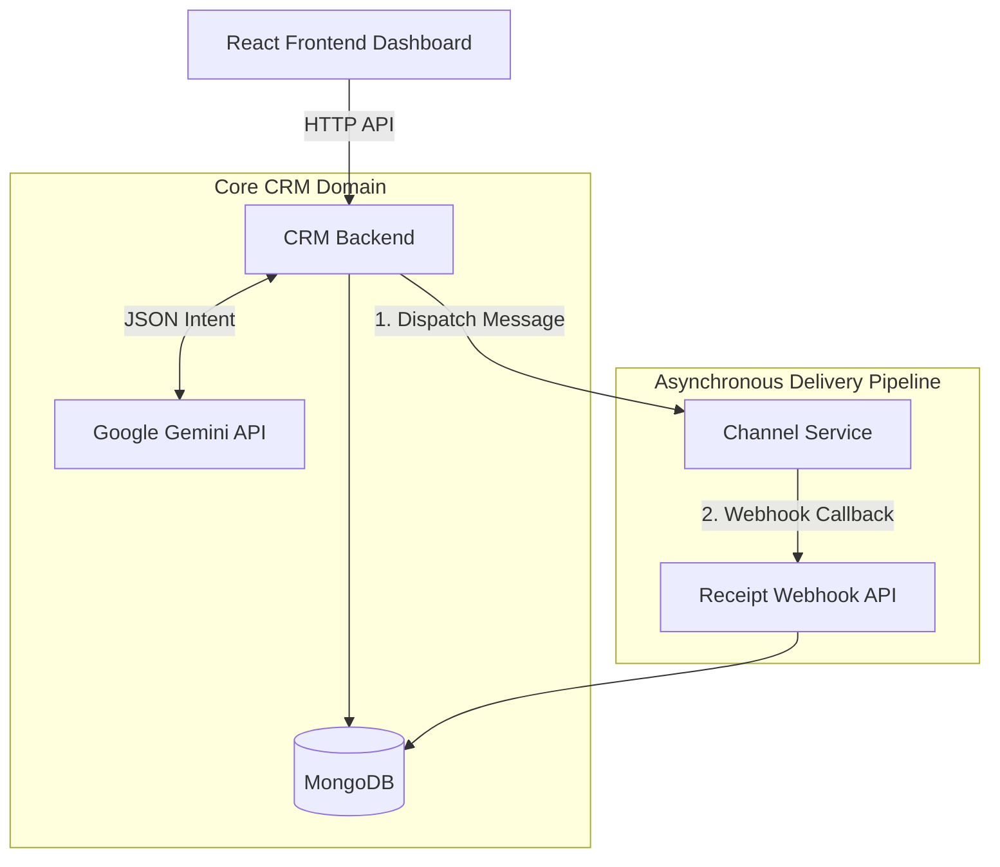

# Xeno AI-Native Mini CRM

An AI-powered marketing CRM engineered to shift the marketer's workflow from manual execution to intent-driven orchestration. Marketers provide natural language goals, and the CRM acts as an "AI Copilot" to autonomously create audience segments, generate personalized multichannel copy, dispatch campaigns, and analyze performance.

---

## 1. Project Overview

The traditional CRM model forces marketers to manually assemble audience filters and write copy from scratch. This project demonstrates an **intent-driven workflow**. The user simply states their intent (e.g., *"Bring back premium customers who haven't purchased recently"*). The backend AI intelligence engine translates this intent into machine-readable segment rules, generates platform-optimized copy (Email, SMS, WhatsApp), and orchestrates an asynchronous delivery pipeline.

---

## 2. Architecture

The system is decoupled into three primary tiers: a React frontend, a core CRM backend, and a dedicated mock channel service to simulate real-world provider latency and asynchronous callback receipts.



---

## 3. Features

*   **Customer Ingestion API**: Ingests raw customer profiles via API.
*   **Order Management**: Processes orders and automatically updates denormalized customer purchase summaries.
*   **AI Segmentation**: Translates natural language goals into strict, verifiable JSON querying rules (e.g., `{ minSpend: 5000, inactiveDays: 60 }`).
*   **AI Message Generation**: Generates contextual, channel-specific copywriting with `{{name}}` placeholders.
*   **Campaign Lifecycle**: Tracks the end-to-end journey from draft creation to audience preview and final dispatch.
*   **Async Communication Tracking**: Uses a dedicated `CommunicationLog` collection to track individual message states (Pending, Sent, Delivered, Opened, Clicked, Failed).
*   **AI Analytics**: Interprets campaign funnel metrics against industry benchmarks to offer actionable strategic recommendations.

---

## 4. The AI-Native Approach

This is **not a chatbot wrapper**. It relies on structured intelligence:

*   **Intent-Driven Workflow**: The AI translates human intent into executable actions. The user acts as an editor/approver rather than a manual builder.
*   **Strict JSON Enforcement**: Prompts are aggressively designed (using low temperature and JSON schemas) to return deterministic, machine-readable rules that safely interact with MongoDB.
*   **Graceful Degradation**: If the AI provider is down, rate-limited, or unavailable (missing API key), the system falls back to hardcoded, sensible marketing defaults. The application continues to function normally.

---

## 5. System Design Decisions

*   **Why a Separate Channel Service?** To simulate the unreliability and latency of third-party providers (like Twilio or SendGrid). It proves the CRM can handle distributed state management without blocking the main event loop.
*   **Why a Dedicated `CommunicationLog` Collection?** Appending thousands of delivery events to a single Campaign document exceeds MongoDB's 16MB document limit. A separate collection ensures scalability and granular indexing.
*   **Why Asynchronous Callbacks?** Waiting for a provider to confirm "Delivered" via synchronous HTTP would cause connection timeouts. Firing HTTP dispatches and waiting for webhook receipts is the industry standard for event-driven delivery.
*   **Why Denormalized Customer Purchase Summaries?** Running complex aggregations (e.g., `totalSpend`, `lastPurchaseDate`) across millions of raw order rows for every campaign segmentation would be extremely slow. We compute and denormalize this data on write, making read queries instantaneous.

---

## 6. Scaling Path (Current vs. Production)

| Component | Current Implementation | Production Evolution |
| :--- | :--- | :--- |
| **Database** | MongoDB (Single Instance) | MongoDB Replica Set with Sharding |
| **Campaign Dispatch** | Node.js `Promise.allSettled` | Kafka/RabbitMQ Task Queue + Worker Nodes |
| **Callbacks** | Direct HTTP Webhooks | Webhook Ingestion Queue + Redis caching |
| **Analytics** | On-the-fly Mongoose Counts | OLAP Database (ClickHouse/Snowflake) |

---

## 7. Tech Stack

*   **Frontend**: React, Vite, Tailwind CSS, Recharts, Axios, Lucide Icons
*   **Backend**: Node.js, Express.js
*   **Database**: MongoDB, Mongoose
*   **AI**: Google Generative AI (`gemini-1.5-flash`)

---

## 8. Local Setup Instructions

### Prerequisites
*   Node.js (v18+)
*   MongoDB running locally on default port `27017`

### 1. Backend (`/crm-backend`)
```bash
cd crm-backend
npm install
cp .env.example .env 
# Add your GEMINI_API_KEY to .env (System will fallback safely if omitted)
npm run seed  # Generates 50 dummy customers and orders
npm run dev   # Starts on port 5001
```

### 2. Channel Service (`/channel-service`)
```bash
cd channel-service
npm install
npm run dev   # Starts on port 5002
```

### 3. Frontend (`/frontend`)
```bash
cd frontend
npm install
cp .env.example .env
npm run dev   # Starts on port 5173
```

---

## 9. Tradeoffs & Assignment Scope

*   **Authentication**: Omitted for the sake of assignment focus. In production, JWT middleware is required.
*   **Queueing**: Node `setTimeout` and `Promise.all` are used to simulate retries and parallel dispatch. A real production system would mandate a message queue (SQS/Kafka) to prevent data loss on server crash.
*   **Basic String Regex**: `{{name}}` personalization is achieved via a `.replace()` regex for simplicity, whereas a production templating engine like Handlebars or Liquid would be used for complex dynamic content.
